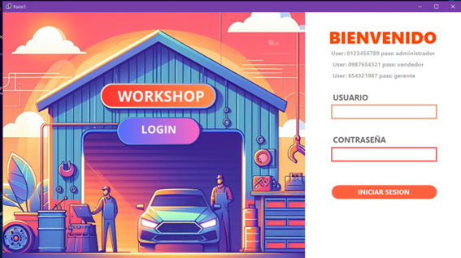

# GUIA DE INSTALACION

## Índice
- [Instalación de SQL Server](#instalación-de-sql-server)
- [Instalación de IDE Visual Studio](#instalación-de-ide-visual-studio)
- [Descarga de Archivos del Proyecto](#descarga-de-archivos-del-proyecto)
  - [Opción 1](#opción-1)
  - [Opción 2](#opción-2)
- [Ejecución del Programa](#ejecución-del-programa)

---

## Instalación de SQL Server

1. Ingresar a la página [Descargas de SQL Server | Microsoft](https://www.microsoft.com/en-us/sql-server/sql-server-downloads).
   
2. Seleccionar "Descargar ahora" debajo de la opción Developer.

   

   
   

3. Una vez descargado el instalador, ejecutarlo y se mostrará la siguiente ventana.

   

   
   

4. Seleccionar "Instalación básica".

   

   
   

5. Seleccionar "Sí" y luego en "Aceptar".

   

   
   

6. Seleccionar "Instalar".

7. Una vez instalado, se mostrará la siguiente ventana.

   

   
   

8. Seleccionar "Instalar SSMS" (SQL Server Management Studio).

   

   
   

9. Bajar hasta donde dice "Descarga de SSMS" y presionar en "Descargar SQL Server Management Studio (SSMS)".

   

   
   

10. Una vez descargado el instalador, iniciarlo y se mostrará la siguiente ventana.

    

    
    

11. Seleccionar "Instalar" y esperar hasta que finalice la instalación.

    

    
    

12. Una vez finalizado, presionar en "Cerrar" y abrir el programa SQL Server Management Studio.

13. En la ventana que aparece con la información ya rellenada, presionar en "Connect" para conectarse al servidor de base de datos.

    

    
    

---

## Instalación de IDE Visual Studio

1. Ir al enlace [Descargar Visual Studio Tools: instalación gratuita para Windows, Mac, Linux](https://visualstudio.microsoft.com/downloads/).

2. Seleccionar la opción "Descarga gratuita" de Comunidad.

    

    
    

3. Una vez descargado el instalador, ejecutarlo.

    

    
    

4. Presionar en "Continuar" y se mostrará la siguiente ventana.

    

    
    

5. Después de completarse el proceso, se muestra la siguiente ventana. Seleccionar la opción "Desarrollo de escritorio .NET".

    

    
    

6. Seleccionar el apartado de componentes individuales y asegurarse de tener marcada la opción ".NET 6.0 Runtime" y seleccionar "Instalar".

    

    
    

7. El proceso de instalación empezará. Esperar hasta que la instalación termine.

    

    
    

8. Una vez finalizado el proceso de instalación, se muestra la siguiente ventana. Seleccionar "Omitir", iniciar sesión o crear una cuenta para iniciar sesión.

    

    
    

9. Seleccionar un tema y presionar en "Iniciar Visual Studio".

    

    
    

10. Se mostrará la ventana de inicio de Visual Studio.

    

    
    

---

## Descarga de Archivos del Proyecto

### Opción 1

1. Seleccionar la opción "Clonar un repositorio" en la ventana de Visual Studio y pegar el siguiente enlace en donde dice "Ubicación del repositorio": [https://github.com/jeremyquinde/ProyectoConstruccion.git](https://github.com/jeremyquinde/ProyectoConstruccion.git).

2. Presionar en "Clonar".

    

    
    

### Opción 2

1. Ingresar al [GitHub del proyecto](https://github.com/jeremyquinde/ProyectoConstruccion).

    

    
    

2. En el botón verde que dice `<> Code`, presionar y se despliega el siguiente menú de opciones.

3. Seleccionar la opción de "Download .zip".

    

    
    

4. Descomprimir la carpeta y se mostrarán las siguientes carpetas. Ingresar en la carpeta "proyecto construcción".

    

    
    

5. Una vez dentro de la carpeta, ejecutar `ProyectoFinalCS.sln`. Esto abrirá el proyecto directamente en Visual Studio.

    

    
    

---

## Ejecución del Programa

1. Dentro de la carpeta "proyecto construcción" antes descargada, ejecutar el archivo `SQLProyectoFinal`.

2. Se abrirá dentro del programa SQL Server Management Studio. Seleccionar todo con `Ctrl+A` o con el ratón y presionar en el botón "Execute".

    

    
    

3. Esto iniciará el proceso de creación de tablas y procedimiento almacenado.

4. Una vez completado el proceso de la base de datos, volver a la ventana de Visual Studio con el proyecto abierto.

    

    
    

5. Presionar en el botón de "play" relleno en verde que dice "CapaPresentacion", el cual inicia el proyecto en modo debug, o el botón de "play" con bordes en verde que inicia el proyecto sin modo debug.

    

    
    

6. Esto iniciará el programa con la ventana de inicio de sesión.

    

    
    

``
